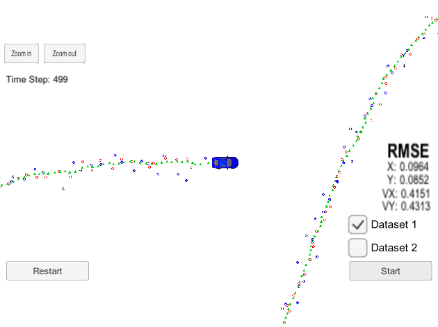

# Extended Kalman Filter Project Starter Code
Self-Driving Car Engineer Nanodegree Program

In this project I utilized kalman filter to estimate the state of a moving object of interest with noisy lidar and radar measurements. The code also calculates the RMSE values for estimated state variables that are lower than the required tolerance in the project rubric. 

This project involves the Term 2 Simulator which can be downloaded [here](https://github.com/udacity/self-driving-car-sim/releases)

## Files in this repository

`src`: The folder containing the source codes:
* `main.cpp`: The main file to read data, call EKF functins to process data and estimate states and calculate RMSE
* `fusionEKF.cpp`: Initializes the sates, calls the Kalman Filter predict and update functions.
* `kalman_filter.cpp`: Contains the predict function and update for Radar and Lidar measurements.
* `tools.cpp`: Contains functions for caliclating Jacobian matrix and RMSE.

`data`: A forlder containing the sensor data

## How to run the codes

1. Clone this repo.
2. Make a build directory: `mkdir build && cd build`
3. Compile: `cmake .. && make` 
4. Run the file: `./ExtendedKF`. 

## Sensor fusion algorithm
I followed the Kalman Filter algorithm to predict and update based on  measruments from Radar and Lidar sensors. The predict function is the same for either measruments while the update is different for Lidar and Radar measurements. The Lidar update is based on the linear Kalman Filter formulas while the Radar update is based on Extended Kalman Filter (EKF) formulas with calculating Jacobian matrix at the current state.

## Results
The final state estimation [px, py, vx, vy] RMSE with both sensors was reported to be [0.0964, 0.0852, 0.4151, 0.4313] which satisfies the project expection of [.11, .11, 0.52, 0.52]. Here is the last frame of simulation in the simulator window with the calculated RMSE: 

I also tried using only one of the sensors to estimate the state. Using only radare results in RMSE of [0.2279, 0.3460, 0.5728, 0.7970] showing inaccurate position measurement by the Radara sensor. By using only the Lidar data the estimations result in RMSE of [0.1470, 0.1153, 0.6097, 0.5378] that showes higher position accuracy as expected. Interestingly, as mentioned before using both sensors results in lower RMSE that shows the power of sensor fusion using Kalman Filter.  
